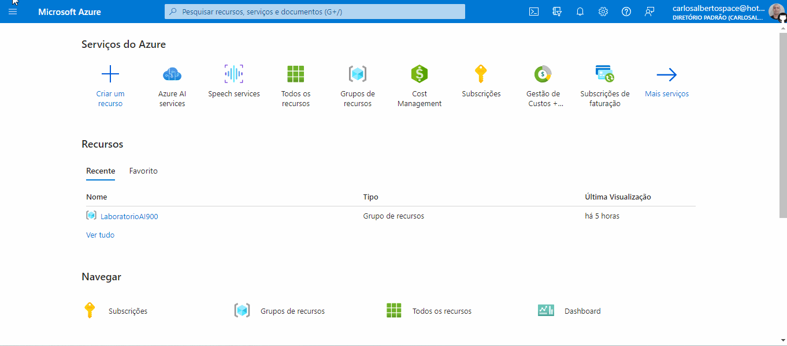
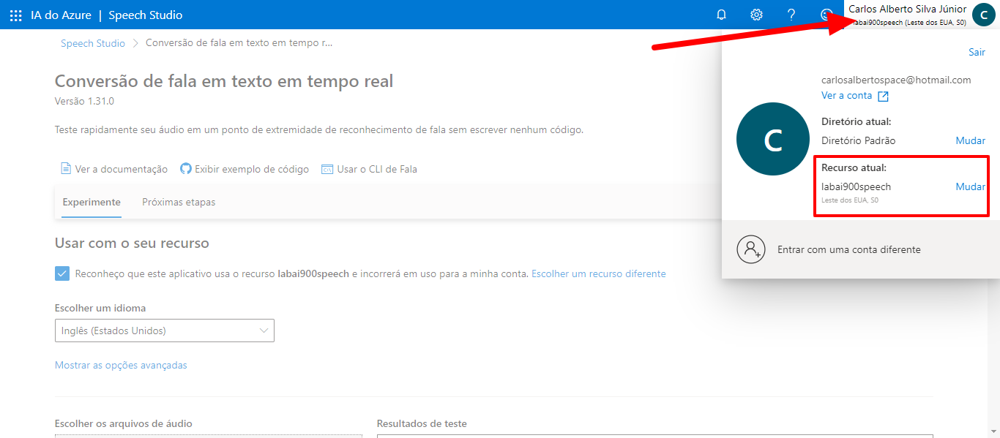
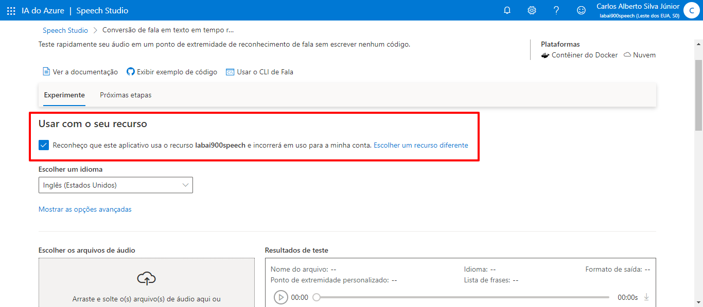
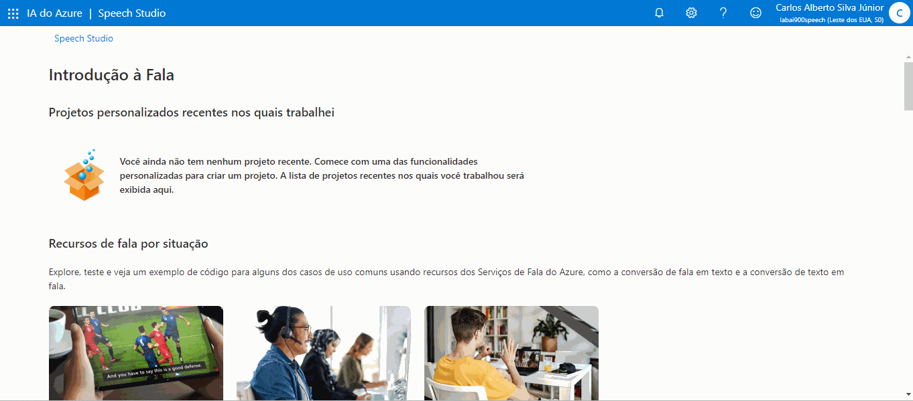
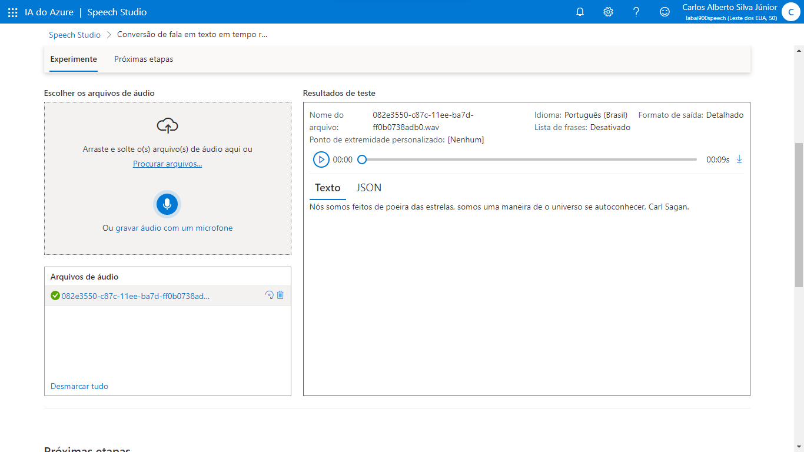
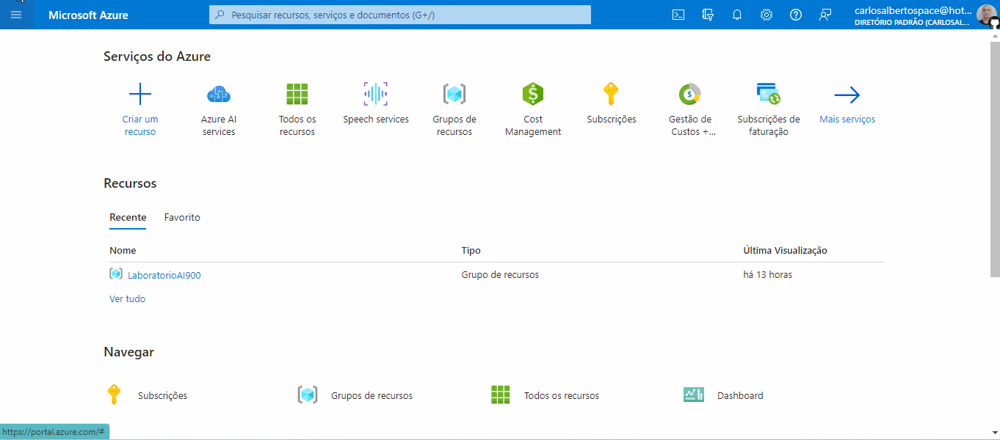
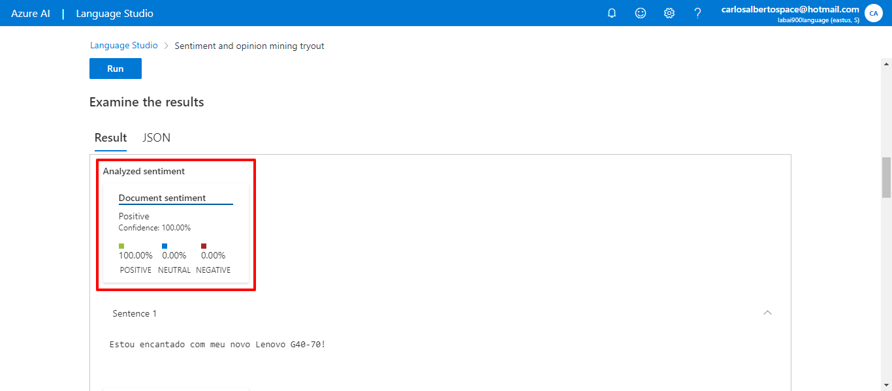
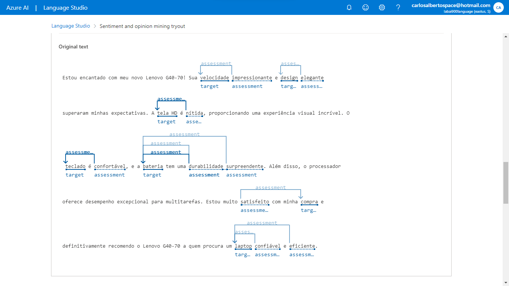

# Análise de Sentimentos com Language Studio no Azure AI

Passo a passo do desafio de projeto "Análise de Sentimentos com Language Studio no Azure AI" da DIO.

Links importantes:

[Explore Speech Studio](https://aka.ms/ai900-speech)

[Analyze text with Language Studio](https://aka.ms/ai900-text-analysis)

# Tópico 1: Primeiramente, conhecendo a função de converter fala para texto

## Passo 1: Criando recurso do Speech service no Azure AI Services e convertendo fala em texto

Primeiro precisei criar um recurso do Speech service dentro do Azure AI Services.

Após o recurso ter sido criado, acessei o [Estúdio de fala do Azure](https://speech.microsoft.com/portal). Na página inicial, no tópico "Conversão de fala em texto", cliquei em "Conversão de fala em texto em tempo real".

Na próxima página, precisei indicar o recurso anterior que eu iria usar. Para isso, cliquei em meu nome no canto superior, e em "Recurso atual", mudei para o recurso criado anteriormente no Portal do Azure.

Assim o checkbox informando sobre o uso do recurso ficou disponível.

Entretando, essa é a forma que segui para criar e usar o recurso. A forma utilizada no vídeo para criar o recurso dentro do Estúdio de fala deve funcionar.

Em seguida, fiz o upload de uma gravação de voz que eu havia feito minutos antes. A fala foi convertida para texto muito rapidamente.

Esse foi o resultado da conversão:

## Passo 2: Testando o SDK no Google Colab

Para finalizar, testei o uso do SDK para realizar a conversão de fala para texto usando o Python. [Clique aqui](./Conversão_de_fala_em_texto_em_tempo_real.ipynb) para ver o notebook desse teste.

# Tópico 2: Análise de sentimento

## Passo 2: Criando um recurso do Language Service no Azure AI Services

Primeiro precisei criar um recurso do Language Service dentro do Azure AI Services.

Após o recurso ter sido criado, acessei o [Estúdio de linguagem do Azure](https://language.cognitive.azure.com/).

Assim que loguei, precisei indicar a minha assinatura e o recurso que eu havia criado em um modal que abriu. Também é possível criar um novo recurso de linguagem aqui.

Após isso, abri a aba "Classify text" e cliquei em "Analyze sentiment and opinions". Em "Select text language", escolhi Portuguese (Brazil) e em seguida colei uma opinião positiva sobre um computador para testar.

Ao testar, inseri o seguinte texto:

Estou encantado com meu novo Lenovo G40-70! Sua velocidade impressionante e design elegante superaram minhas expectativas. A tela HD é nítida, proporcionando uma experiência visual incrível. O teclado é confortável, e a bateria tem uma durabilidade surpreendente. Além disso, o processador oferece desempenho excepcional para multitarefas. Estou muito satisfeito com minha compra e definitivamente recomendo o Lenovo G40-70 a quem procura um laptop confiável e eficiente.

Resultado da análise do texto:

Resultado no texto original:

Para finalizar, testei o uso do SDK para realizar a análise de sentimentos para texto usando o Python. [Clique aqui](./Análise_de_sentimentos_no_Azure.ipynb) para ver o notebook desse teste.
